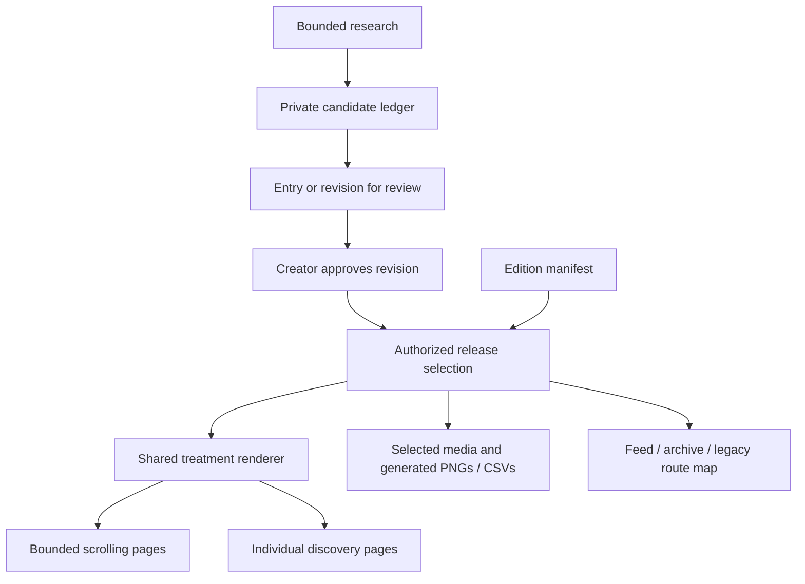
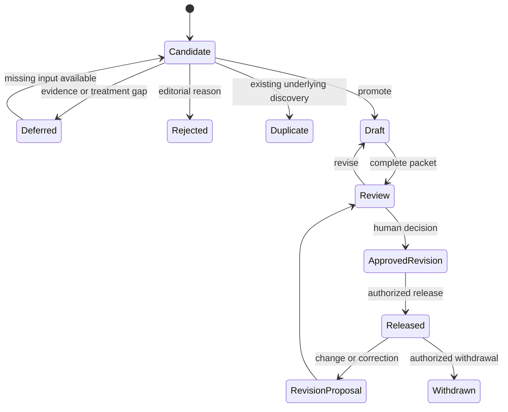
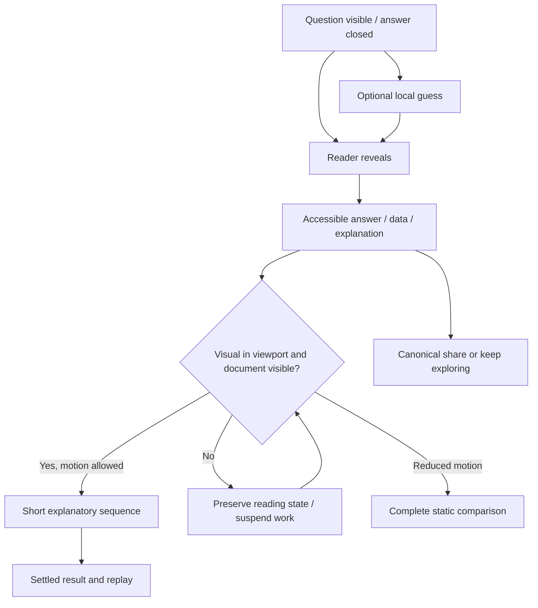
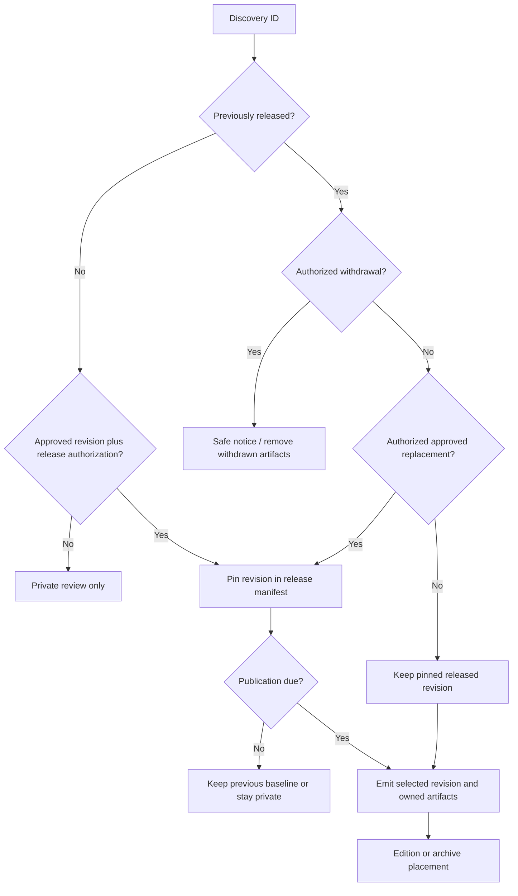

# A Growing World of Discoveries - Plan

## Goal Capsule

- **Objective:** Give readers a growing collection of surprising, visually memorable discoveries they want to explore and share, with an editorial workload one person can sustain.
- **Means:** Extend the existing static site through reusable visual treatments, individual discovery pages, a candidate desk, and dated reader editions (KTD1–KTD8).
- **Authority:** Current human instructions and `AGENTS.md` govern execution. Product behavior belongs to the R-IDs below; KTDs choose mechanisms within those constraints. Historical ideation supplies ambition, not permission to override later decisions.
- **Execution profile:** Deliver the eight units in phases. U1–U3 form the first reviewable slice. U4 supplies independent reader evidence before expanding the visual library; editorial tooling can progress alongside recruitment. Run the pending version 2 chip visual check now, on the local published edition (which excludes review entries such as the Senate draft); U4 recruits a separate unexposed group so neither check spoils the other.
- **Stop conditions:** Stop dependent work on missing editorial approval, unavailable fresh-reader evidence, or a failed quality gate. Continue independent units. Do not manufacture research results or reader responses to satisfy completion.
- **Tail ownership:** The implementer owns code, verification, and a concrete release candidate. The creator owns reader recruitment, editorial decisions, and release authorization. A roadmap is not standing permission to publish daily or reconnect Vercel to the private repository.

---

## Product Contract

### Summary

Make the spectacle repeatable. A small family of distinctive visual forms should let new discoveries feel authored without requiring an entirely new scene each time. Preserve the scrolling collection while giving each discovery its own shareable page. Expand research into a bounded candidate pipeline, then establish a three-discovery reader edition from an approved backlog.

The recommended identity is curiosity across playful and serious subjects. Political data belongs when the comparison is understandable, surprising, and honestly framed. The existing “wonderfully unnecessary” tagline remains provisional; this work does not settle new brand copy.

### Problem Frame

The source and publishing systems advanced faster than the reusable visual experience. Four bespoke scenes coexist with plain reveal/bar/line treatments, making the easiest new entry the least distinctive kind. Individual hash links lack individual social previews. Daily activity currently benefits the editor; it does not guarantee fresh public content for a returning reader.

The creator's responses and relayed girlfriend feedback give useful direction, but the current protocols have no recorded independent fresh-reader results. More polish or more entries alone cannot establish novelty, comprehension, sharing, or demand.

### Key Decisions

- **Continuous scrolling with an orange identity.** Governs R1. (session-settled: user-directed — chosen over the original top-level topic picker: the collection should invite wandering.)
- **Optional guessing.** Governs R2. (session-settled: user-directed — chosen over guessing as the central activity: anticipation should not turn browsing into an obligation.)
- **Daily drafts for human review.** Governs R9, R10. (session-settled: user-directed — chosen over automatic publication after editorial checks: the creator retains the publishing decision.)
- **Broader product roadmap.** Governs R3, R6, R11. (session-settled: user-directed — chosen over planning only the Senate/share-page slice: the next work must restore the larger product ambition.)

### Requirements

**Discovery and visual experience**

- R1. Keep the primary experience orange-led and continuously scrollable, with varied compositions and ordinary browser navigation.
- R2. Preserve anticipation on reveal entries, offering a direct reveal alongside any optional guess; visible pre-reveal copy, graphics, accessibility labels, and share previews must not disclose the answer.
- R3. Establish three reusable expressive forms in this delivery, each demonstrated with two materially different content examples before calling it reusable; keep the existing bespoke scenes supported.
- R4. Motion must explain the discovery and begin when its visual is encountered, with a complete reduced-motion and silent reading path.
- R5. Evaluate familiarity, comprehension, retelling, visual enjoyment, and voluntary continuation separately with fresh readers before multiplying a treatment or declaring an opener successful.

**Sharing and collection growth**

- R6. Every public discovery gets a stable individual page and a question-led share preview, with an onward route into the collection.
- R7. Growing the collection must preserve old discovery links and keep each scrolling page bounded rather than loading every scene at once.
- R8. Public HTML, media, metadata, data exports, feeds, and indexes must contain only content eligible for that release; local review output remains excluded from deployment.

**Editorial flow**

- R9. Expand daily research into a bounded candidate queue without committing, pushing, publishing, deploying, contacting others, or changing integrations during automated runs.
- R10. Bind editorial approval to the reviewed content revision and preserve the released version while revisions await review; release authorization remains distinct from content approval.
- R11. Provide a dated three-discovery reader Spread from eligible approved content, identifying resurfaced discoveries and retaining the last real edition when no new release is authorized.
- R12. Make candidate identity, rejection reasons, evidence gaps, treatment blockers, queue size, and partial run outcomes visible to both creator and drafting agent.
- R13. Apply political evidence requirements across every treatment, and record reuse provenance for source data and incorporated assets without presenting a validator as proof of factual or legal correctness.

### Actors and Key Flows

- A1. Reader arriving at the collection or a shared discovery.
- A2. Creator reviewing content and deciding releases.
- A3. Drafting agent researching and preparing reviewable work.

- F1. A1 opens a question, optionally guesses, reveals, reads the explanation, then shares that discovery or continues scrolling. Covers R1–R7.
- F2. A3 saves candidates, verifies promising ones, proposes a treatment, and prepares a private review packet; A2 keeps, revises, or rejects it. Covers R9, R12, R13.
- F3. A2 approves an exact revision and separately authorizes its release; the build emits eligible records across all public surfaces. Covers R8, R10.
- F4. A returning A1 sees the latest dated Spread, then explores older editions and individual discoveries. Covers R7, R11.

### Acceptance Examples

- AE1. A shared Senate question opens with its answer hidden. Revealing presents population and Senate seats together, so the reader does not need a toggle to discover the contrast. Covers R2, R6.
- AE2. A review-only entry has a draft image and CSV. A normal release emits none of its page, image, CSV, metadata, or catalog links, even when its ID is guessed directly. Covers R8.
- AE3. An editor changes an approved comparison's values. That revision cannot be released under the old approval, and the previously released revision remains available until a replacement is approved. Covers R10.
- AE4. Yesterday's Spread remains the latest authorized edition. The site displays yesterday's date and archive links rather than relabeling it “today” or substituting drafts. Covers R11.
- AE5. A reader scrolls past the mail scene before it initializes and later returns. The scene is available when encountered; hidden-tab animation time and a rejected audio permission do not consume the discovery. Covers R4.

### Success Criteria and Gates

These are initial operating thresholds, not claims about audience demand.

- **Visual gate:** Run a small exploratory check with three to five unexposed readers. Count a reader toward comprehension only when they report the underlying relationship as new: among those readers (at least three), all but one explain the prototype's central relationship without coaching. A majority of all readers voluntarily continue to another discovery. Report familiar readers' explanations separately; a round with fewer than three unfamiliar readers is inconclusive for the form, not a pass. Record novelty and actual retellings separately. A failed threshold triggers revision and a fresh check, not a redefinition of success. Passing permits expansion, not a retention claim.
- **Reuse gate:** A second example in each form changes subject and data without editing that form's renderer. Fictional fixtures prove rendering; reviewed real examples prove editorial usefulness. Real examples come from familiarity-screened candidates, not the parked familiarity-risk entries. Neither example needs automatic publication.
- **Editorial gate:** Observe seven completed daily research runs and log candidates examined, usable promotions, time spent reviewing, and backlog age. Increase the research budget only when the creator can clear the resulting review workload.
- **Reader-cadence gate:** Rehearse seven dated Spreads using the approved backlog, recording how many discoveries are new versus resurfaced. Do not advertise three new discoveries every day on the strength of a rotating archive. Each rehearsed Spread must include at least one first-publication discovery from the approved backlog; if the backlog cannot supply that, the gate fails, public Spread releases wait under the stop conditions, and the rehearsal reports the shortfall. The creator may raise this minimum before the rehearsal.

### Roadmap Horizons

| Original idea | Near-term commitment | Entry condition for the next horizon |
|---|---|---|
| Seven Forms | Paired comparison plus the two forms that reviewed, familiarity-screened candidates need (Unit Pile and Scale Drop are the defaults where such candidates exist); retain custom scenes | Expand to Rate Clock, You-Are-Here, Rank Race, and Map Bloom when researched entries need them and current forms pass R3/R5 |
| Receipts | Shared evidence rules, revision approval, data/media provenance | Add source-specific freshness and revision adapters when repeated manual checks justify them |
| Guess First | Optional local choices with useful reveal feedback | Crowd comparisons require actual audience participation, a privacy/abuse design, and honest sample labels before collecting responses |
| The Mint | Bounded candidates, deduplication, promotion, review packets | Mine larger named datasets only after the editorial gate shows sustainable yield and review time |
| Daily Spread | Dated three-discovery selection, archive, clear reuse labels | Public daily scheduling requires explicit release policy and an approved backlog; three newly researched items per day is a separate capacity target |
| Number Line | Preserve structured quantity/unit metadata where meaningful | Prototype as an optional browse view once enough compatible quantities exist; use separate unit lanes, not a universal ranking of unlike quantities |
| Stat Crew | Preserve dated snapshots and correction proposals | Pilot one precisely defined record from one reliable source as draft alerts; define lag, revisions, outages, and “first since” coverage before any live claim |

### Scope Boundaries

Active delivery is U1–U8. The Senate entry is a test of a visual form and sharing flow, not an approved publication or a settled homepage opener. Preserve historical reader notes verbatim; update current guidance rather than rewriting past decisions.

**Deferred to Follow-Up Work:** crowd-response storage, accounts, saved collections, Number Line UI, live-record detection, additional visual families, a CMS, hosted research workers, automatic daily deployment, and Vercel Git integration. Each horizon above names the evidence or decision that brings it back into scope.

**Outside this delivery:** infinite rendering of the full catalog, forced quizzes, fabricated crowd statistics, production reader tracking, Git history cleanup, and replacing all bespoke scenes merely for uniformity.

---

## Planning Contract

### Key Technical Decisions

- KTD1. **Keep Node 22 and static generation.** Extend `scripts/build.mjs` and the record/render boundaries in `scripts/content.mjs` rather than migrate frameworks. Emit collection and discovery pages from one selected catalog. This satisfies R6–R8 with the architecture already documented in `docs/content-system.md`.
- KTD2. **Separate evidence, treatment, and page context.** A registry defines each form's inputs, renderer, assets, and runtime initializer. Page context supplies canonical, onward, source-data, and asset URLs. New forms get reader copy from records; the four custom fragments remain supported through adapters. Place common political validation before treatment-specific returns (R13).
- KTD3. **Use entry-scoped state and motion.** Keep guess/reveal state distinct from motion state. Prepare near the viewport, play only when the actual visual is visible, suspend offscreen or in a hidden document, and provide explicit replay after the sequence settles. Re-entry must not re-hide an answer or restart audio. Extend existing mail/chips lifecycle patterns; use [Intersection Observer visibility guidance](https://developer.mozilla.org/en-US/docs/Web/API/Intersection_Observer_API/Timing_element_visibility), [Page Visibility](https://developer.mozilla.org/en-US/docs/Web/API/Page_Visibility_API), and [W3C reduced-motion guidance](https://www.w3.org/WAI/WCAG22/Techniques/css/C39). Nonessential animation should settle within five seconds; persistent movement needs pause/stop controls under [W3C guidance](https://www.w3.org/WAI/WCAG22/Understanding/pause-stop-hide).
- KTD4. **Generate static individual routes and share PNGs.** Use `/discoveries/<id>/index.html` output with slash-ended canonical URLs and an explicit public site origin. Generate 1200 × 630 PNGs at build time from a shared SVG composition using a pinned build-only rasterizer; [`@resvg/resvg-js`](https://github.com/thx/resvg-js) supplies SVG-to-PNG and bundled-font rendering; verify the pinned version on local and Vercel Node 22 at execution. Disable remote image loading and bundle approved fonts for deterministic output. Use original typography/object silhouettes with recorded rights. Metadata is present in initial HTML and remains question-led, including image alt. [Open Graph](https://ogp.me/) governs metadata; [Vercel static serving](https://vercel.com/docs/directory-listing) and [trailing slash configuration](https://vercel.com/docs/project-configuration/vercel-json#trailingslash) support the route shape. No SPA catch-all.
- KTD5. **Select assets as well as records.** Replace the unconditional copy of all `public/` assets with shared-shell assets plus assets owned by eligible entries. Generate CSV, OG, feed, route-map, and catalog outputs from the same selection. Keep editorial-only assets outside the public copy root. Fail on missing asset ownership or referenced files rather than silently omitting a scene. Covers R8.
- KTD6. **Keep the Mint file-backed and resumable.** Store candidates separately from entries, with stable IDs, claim fingerprints, source locators, dispositions, and run checkpoints. Small composable commands expose the same state to the agent and creator. Start with a configurable cap of ten candidate investigations per run, two promoted drafts per run, and five unfinished review packets; these are ceilings, not quotas. Retries retain their run ID and consumed budget; promotion is idempotent for a candidate/revision pair. The queue cap counts active draft/review packets, including blocked treatment work, and excludes closed/rejected packets. Use optimistic revision checks to preserve concurrent human edits (R9, R12).
- KTD7. **Version the editorial subject of approval.** A content digest covers claim copy, quantitative data, evidence, material qualifications, and declared editorial assets. Custom fragment copy must participate until moved into records. Pure shared layout/runtime fixes use code review rather than new editorial approval. Approval makes a revision eligible; a separate release manifest pins public IDs to the revisions authorized for release. Approval alone never advances that manifest. Proposals name their baseline digest and require reconciliation if it changed. Digest serialization excludes generated dates/URLs and approval bookkeeping. Establish carry-forward baselines from actual approval/release evidence, not the current checkout; unmatched local changes become proposals, and an unresolvable baseline needs the creator to identify what was approved. A custom scene's working fragment (`src/exhibits/<id>.html`) always holds its released copy; unapproved copy edits live as proposal fragments under `content/revisions/` and replace the working file only on approval. Compute the custom-fragment digest from extracted visible text, accessible labels, alt text, and source links rather than raw markup, so runtime or markup refactors update the working fragment through code review without new approval. The release build recomputes each emitted fragment's and declared asset's digest against the release manifest and fails, rather than emitting, on a mismatch. U1 defines the minimal revision/release contract, and U7 supplies its migration and editorial tooling (R10, R13).
- KTD8. **Make editions explicit and bounded.** A dated manifest records ordered entry IDs, first-publication versus resurfacing labels, and the creator's release choice. Initially serve three discoveries per Spread and up to six full scenes per collection page, with ordinary continuation/archive links. Dates use America/Chicago at release; a visitor's clock never selects unpublished material. Keep latest-edition navigation static and rebuild only through the authorized release path (R7, R11).

### High-Level Technical Design

The diagrams describe component boundaries and behavior; the R-IDs and KTDs own the detailed rules.

**Content and build flow (KTD1, KTD2, KTD5–KTD8)**

**Editorial lifecycle (R9, R10, R12)**

**Reader and motion lifecycle (R2, R4)**

**Release selection decisions (R8, R10, R11)**

### Compatibility and Failure Behavior

New shares use canonical discovery routes. Maintain a generated public ID-to-route map for old root hash links when the entry is no longer on the current page; a no-JavaScript archive provides a usable fallback. Never-published IDs return a real not-found response. A withdrawn previously public discovery gets a minimal notice at its stable route with safe metadata and onward navigation, without republishing the withdrawn graphic or CSV. Cached third-party previews may persist and cannot be recalled by a local build.

An overdue historical entry remains clearly dated pending review; a review-due date does not prove the old measurement false. Keep ordinary historical snapshots separate from correction/withdrawal decisions. Browser Back should restore position and reading state on same-session navigation where supported; a newly shared URL always starts unrevealed. Guesses stay local to the session and never appear in URLs, share art, or telemetry.

An interrupted Mint run resumes from saved work and rechecks revisions before writing. Source unavailability is a deferred candidate, not a rejection or invented verification. A full review queue blocks further promotion while allowing bounded discovery notes. A failed research run leaves the last authorized public release intact.

### Sequencing, Risks, and Assumptions

U1–U3 prove the complete experience locally. Public rollout of the new route system waits for U7 approval-baseline migration and release-manifest validation; rerun U3 deployment verification at that point. U4 governs expansion into U5. U6 can proceed after U1 while reader recruitment is pending. U7 completes the editorial boundary before U8's reader-cadence rehearsal. This order deliberately limits infrastructure work before visual evidence.

The working treatment choices are paired comparison, Unit Pile, and Scale Drop. They reuse existing comparison/zoom strengths without promising seven polished mechanisms at once. They are planning recommendations, not claims that readers have chosen them. Unit Pile and Scale Drop are defaults: U5 builds them only where reviewed, familiarity-screened candidates need them, and otherwise builds the form those candidates need under the same R3/R5 rules.

The public site currently has reported login protection; this planning run has not checked its deployment settings. [Vercel protection](https://vercel.com/docs/deployment-protection) can prevent anonymous crawlers from fetching a page or image. Metadata inspection on a protected preview does not prove public sharing; verify an authorized public origin before claiming it works. Never put a bypass credential in a share URL.

The local drafting heartbeat is best-effort execution. Increasing candidate limits does not make it a hosted scheduler, and future timestamps do not deploy anything. A sustained unattended public cadence needs its own explicitly authorized release policy.

**Deferred execution questions:** exact rasterizer version/platform support; measured mobile resource budget; independent reader results; actual candidate yield/review time; public crawler reachability. Each belongs to its named unit's verification. None permits substituting a fabricated result or silently expanding publication authority.

---

## Implementation Units

### U1. Establish reusable treatment and publication boundaries

- **Goal:** Let a discovery render consistently across collection and individual-page contexts without weakening its evidence or asset boundaries.
- **Requirements:** R1–R4, R8, R13.
- **Dependencies:** None.
- **Files:** `scripts/content.mjs`, `scripts/build.mjs`, `scripts/check.mjs`, `scripts/new-entry.mjs`, `src/treatments/registry.mjs`, `content/releases/` (new), `public/discoveries.js`, `public/app.js`, `public/crunch.js`, `src/exhibits/`, `src/shell.html`, `tests/content.test.mjs`, `tests/fixtures/entries.mjs`, `docs/content-system.md`.
- **Approach:** Introduce KTD2's registry/context seam and KTD5's selected asset manifest, including runtime image/audio URLs and scene-specific preloads. Define KTD7's minimal released-ID, pinned-revision, and authorized-withdrawal contract with fictional fixtures; production baseline migration belongs to U7. Move political evidence checks into shared review validation. Include an optional guess definition in the registry contract: answer choices plus per-choice reveal feedback, rendered by the shared reveal controller beside a direct "Show me" action. Adapt current fragments without redesigning them. Scope initializer selectors and IDs to each rendered entry; support cleanup under KTD3.
- **Patterns to follow:** Existing `selectEntries`, escaped generic records, injected fictional records, and temporary test output.
- **Execution note:** Characterize the four current scenes' content and reveal behavior before moving their shared boundaries.
- **Test scenarios:**
  1. Render two instances of the same fictional form: controls, IDs, guesses, and reveals remain independent.
  2. Covers AE2: a private asset and review-only entry are absent from every normal-build output path.
  3. A political plain reveal or new form missing denominator/methodology fails shared validation.
  4. Missing assets or unknown treatment inputs produce actionable errors without modifying test-external output.
  5. An eligible custom scene retains its dynamic media; an unrelated page omits its media and preload references.
  6. A rejected replacement keeps the pinned public revision; a withdrawn public ID retains a safe notice, while a never-published retired ID stays absent.
- **Verification:** Existing entries retain their intended presentation; all downstream renderers consume one eligibility decision and explicit page context.

### U2. Build the paired-comparison visual study

- **Goal:** Make the Senate discovery's two quantities land together in one revealing visual moment.
- **Requirements:** R1–R5, R13; AE1.
- **Dependencies:** U1.
- **Files:** `src/treatments/paired-comparison.mjs` (new), `public/treatments/paired-comparison.js` (new), `public/styles.css`, `content/entries/same-two-seats.json`, `tests/treatments.test.mjs` (new), `tests/fixtures/entries.mjs`.
- **Approach:** Ask the straight question before revealing. Show population side by side, then resolve into two versus 42 seat objects while keeping both comparisons visible. Distinct labels/scales prevent implying that people and seats share a unit. Use composition and motion to show the mismatch, not another toggled chart card. Define the Senate entry's optional guess choices and per-choice reveal feedback. Keep this record in review.
- **Patterns to follow:** KTD2/KTD3; current copper reveal feedback and mail visibility lifecycle.
- **Test scenarios:**
  1. Covers AE1: no initial text, labels, hidden-view alternative, or graphic spoils the reveal; after reveal both measures are understandable without another action.
  2. Values match the record, including California's 39,538,223 residents, 37,174,921 residents in the 21-state group, and 2 versus 42 seats.
  3. Reduced motion and keyboard reveal produce the same complete comparison; tab hiding and offscreen re-entry preserve reading state.
  4. A fictional comparison with different group names and proportions renders without Senate-specific assumptions.
  5. The optional guess path and the direct "Show me" path both reach the same complete comparison.
- **Verification:** Inspect desktop and mobile, including the smallest supported viewport. A reader can distinguish residents from voters and the 2020 snapshot from current counts. Visual quality remains subject to U4.

### U3. Give each discovery a page and a share preview

- **Goal:** A shared link carries one curiosity and opens its full interactive experience.
- **Requirements:** R2, R6–R8; AE1, AE2.
- **Dependencies:** U1; use U2 as the first end-to-end review example.
- **Files:** `scripts/build.mjs`, `scripts/share-images.mjs` (new), `src/shell.html`, `src/discovery-shell.html`, `src/exhibits/`, `public/app.js`, `public/crunch.js`, `scripts/check.mjs`, `vercel.json`, `package.json`, lockfile if introduced, `tests/routes.test.mjs` (new).
- **Approach:** Implement KTD4/KTD5. Make all nested-route assets and data links root-relative. Render shared entry content in a single-entry shell that ends with a primary "Keep wandering" link to the collection home page; U8 adds an archive link. Add one share control per scene, available before and after the reveal, that targets the canonical `/discoveries/<id>/` URL: it uses the native share sheet where supported, otherwise copies to the clipboard and announces "Link copied", and on clipboard failure shows the URL in a selectable field. It replaces the generic `#id` link and is added to the four custom fragments; guess state never enters the URL. Add not-found/withdrawal rendering against U1's contract. Until U8 bounds the home page, every public entry stays on it, so existing `#id` links keep resolving; U8 owns the legacy-hash route map and the public discovery index/archive. Use public origin configuration for canonical metadata, never the protected preview origin.
- **Patterns to follow:** Existing build-time HTML and data generation; no browser-side metadata injection.
- **Test scenarios:**
  1. Directly load every route with and without trailing slash; assets, audio-on-request, sources, and onward links resolve.
  2. Question, description, PNG, and alt contain no answer or guess; two IDs produce distinct metadata and images.
  3. Covers AE2: draft/future/revision assets, routes, and feeds remain absent; unknown IDs do not return the homepage.
  4. A withdrawn public ID produces a notice with safe metadata and no withdrawn data artifact.
  5. The share control yields the canonical discovery URL from the collection and the discovery page, before and after reveal, including the clipboard-failure fallback; from a directly loaded discovery route, the "Keep wandering" link resolves to the collection home.
- **Verification:** Verify generated files locally; after U7, verify routing and anonymous image access on an authorized deployment. Inspect an actual social preview; record protection as a blocker if it remains, without bypassing it.

### U4. Check fresh-reader impact before expansion

- **Goal:** Establish whether the new experience is clear, surprising, and inviting beyond the creator's reactions.
- **Requirements:** R5 and the visual/reuse gates.
- **Dependencies:** U2, local portion of U3.
- **Files:** `docs/editorial/visual-forms-reader-check.md` (new), `docs/editorial/reader-results/` (new), `docs/v1-brief.md`, existing version 2 visual/text protocols.
- **Approach:** Extend the current fresh-cohort method to the paired study and share-page arrival. In the same session, record R5 measures for the existing copper (penny pile) and painting (canvas-to-pixel) scenes, which are the prototypes for Unit Pile and Scale Drop. Keep prompt versions fixed within a round. Recruit through the creator; do not message people automatically. Use aliases and minimal notes. Preserve all historical responses and keep text/visual cohorts separate.
- **Patterns to follow:** `docs/editorial/2026-10-04-chip-visual-check.md` and `docs/editorial/2026-10-04-second-reader-check.md`.
- **Test expectation:** No automated test for participant responses; use the documented observation protocol.
- **Verification:** Record the five-reader outcomes against the visual gate, exact retellings, prior familiarity, and where readers stop. If recruitment is unavailable, report evidence pending and leave U5 gated. Do not call a prepared script a completed reader check.

### U5. Extend the library with Unit Pile and Scale Drop

- **Goal:** Make materially different discoveries expressive without cloning custom scenes.
- **Requirements:** R1–R5, R13.
- **Dependencies:** U1–U4 with the visual gate passed. Build Unit Pile or Scale Drop only when its existing prototype scene (copper's penny pile, the painting's zoom) meets the visual gate's comprehension and continuation thresholds in U4.
- **Files:** `src/treatments/unit-pile.mjs`, `src/treatments/scale-drop.mjs`, `public/treatments/unit-pile.js`, `public/treatments/scale-drop.js` (new), `public/styles.css`, `content/entries/`, `tests/treatments.test.mjs`, `docs/visual-forms.md` (new).
- **Approach:** Unit Pile transforms one recognizable object into an intelligible repeated quantity; Scale Drop moves through explicit physical scale anchors to a surprising detail. Use copper/painting as references, without replacing their special scenes by default. Pair each new form and paired comparison with a second real reviewed example under R3. A subject with no suitable treatment remains a candidate instead of forcing a chart.
- **Patterns to follow:** KTD2/KTD3, physical labels in copper, explicit illustrative scale labels in painting.
- **Test scenarios:**
  1. Small, large, and fractional quantities preserve exact labels; grouped or truncated objects show their multiplier honestly.
  2. Scale anchors have compatible units and remain understandable without animation or dragging.
  3. Two different records in each form work without renderer edits or shared state collisions.
  4. Missing evidence, unsupported unit conversion, or invalid quantitative domain fails before review publication.
- **Verification:** Six reviewed examples across the three forms demonstrate variety. Before adding second examples, evaluate the first Unit Pile and Scale Drop examples together in one fresh-reader round under the visual gate (R5). Update form guidance with what actually worked, not only screenshots.

### U6. Expand the Mint into a bounded candidate desk

- **Goal:** Find more promising discoveries while keeping the review queue manageable.
- **Requirements:** R9, R12; F2.
- **Dependencies:** U1; may run alongside U4 recruitment.
- **Files:** `content/candidates/`, `content/research-runs/`, `content/editorial-settings.json`, `scripts/candidates.mjs` (new), `scripts/status.mjs`, `scripts/new-entry.mjs`, `tests/candidates.test.mjs` (new), `docs/editorial/daily-workflow.md`.
- **Approach:** Implement KTD6's ledger and composable list/disposition/promote/report commands. Deduplicate normalized locators mechanically and the underlying discovery editorially. Return created, unchanged, conflict, deferred, or failed outcomes with stable IDs. Update the existing heartbeat prompt through the automation tool when implementation is authorized; preserve its 9 a.m. schedule and R9 boundaries.
- **Patterns to follow:** Existing non-overwriting scaffolder and dated review packets.
- **Test scenarios:**
  1. Re-run a partially completed batch: saved candidates and promotions are not duplicated.
  2. A concurrent creator edit causes an explicit revision conflict rather than an overwrite.
  3. An unreachable primary source, exhausted investigation cap, or full review queue yields a truthful incomplete/deferred result.
  4. A rephrased known discovery links to its earlier rejection or entry before promotion.
  5. Candidate/run/private notes never enter selected public output.
- **Verification:** Creator and agent reports agree. Observe the seven-run editorial gate before raising limits; no claim of thousand-per-night capacity.

### U7. Make review and revision approval scale safely

- **Goal:** Let the creator review a concise queue and know exactly which version is approved.
- **Requirements:** R8–R10, R12, R13; AE3.
- **Dependencies:** U1, U6.
- **Files:** `scripts/content.mjs`, `scripts/review-packets.mjs` (new), `scripts/status.mjs`, `content/revisions/` (new), `content/entries/`, `tests/approval.test.mjs` (new), `docs/content-system.md`, `docs/editorial/daily-workflow.md`.
- **Approach:** Implement KTD7's baseline migration and release-manifest tools alongside a private local review index, claim/data/source changes, form readiness, and keep/revise/reject decisions recorded only from actual human input. Add source-data reuse notes and declared asset rights/attribution. Unknown reuse rights block the affected reused asset or dataset, not ordinary outbound citation. Show correction proposals against the released baseline.
- **Patterns to follow:** Local noindex review build and existing dated editorial packets; no new hosted CMS.
- **Test scenarios:**
  1. Covers AE3: modifying claim copy, values, evidence, or an editorial asset changes the approval digest and prevents its release.
  2. A CSS-only presentation fix does not claim a new editorial decision; changing custom-fragment claim copy does require renewed approval.
  3. Rejecting a revision leaves the released version unchanged; accepting it replaces the correct baseline only.
  4. Original carried-forward entries retain their truthful approval provenance; changed custom copy becomes a proposal and an unresolvable baseline blocks migration for that entry.
  5. Approve revision B while A is pinned: an unrelated rebuild continues emitting A across all public surfaces.
  6. Accept a proposal against an outdated baseline: report a conflict instead of replacing the newer revision.
  7. Missing asset provenance prevents that reused material's release; source links can still be cited normally.
  8. An unapproved custom-fragment copy edit cannot reach public output, while the released scene keeps working with the current runtime (for example, a released chip fragment still binds its reveal after a script refactor).
- **Verification:** A real review packet can be handled without editing several unrelated files or confusing approval with deployment. Candidate/promotion commands reject approval and release fields, including on resume. This is a command contract plus the existing human-authorization policy, not a security barrier against arbitrary repository writes.

### U8. Launch bounded collections and the reader Spread

- **Goal:** Give returning readers a clear latest edition and room to explore a growing catalog.
- **Requirements:** R1, R6–R8, R10, R11; AE4.
- **Dependencies:** U3, U5, U7; cadence rehearsal requires eligible approved content.
- **Files:** `content/editions/`, `scripts/editions.mjs`, `src/archive-shell.html` (new), `scripts/build.mjs`, `src/shell.html`, `public/app.js`, `public/styles.css`, `tests/editions.test.mjs` (new), `docs/v1-brief.md`, `docs/editorial/daily-workflow.md`.
- **Approach:** Implement KTD8's manifests, bounded scenes, lightweight archive, and onward navigation, including the public discovery index, the archive link on discovery pages, and the generated legacy-hash route map for entries no longer on the current page (moved from U3). Load only page-relevant scripts/assets and reserve image dimensions. A Spread may resurface older public discoveries, with accurate labels. If fewer than three eligible entries exist, show fewer; never duplicate entries to fill slots. Keep the last real edition when no release is authorized.
- **Patterns to follow:** Existing deterministic sort/selection, stable IDs, and U3 page contexts. Follow [browser image-loading guidance](https://web.dev/articles/browser-level-image-lazy-loading) for eager opening visuals and lazy below-fold images.
- **Test scenarios:**
  1. Covers AE4: advancing a browser or test clock does not relabel an old release or publish future/draft entries.
  2. Empty, one-entry, and duplicate-ID edition inputs produce a clear empty/fewer state or actionable validation error as appropriate.
  3. A corrected or withdrawn discovery cannot leave a stale numerical teaser, CSV, or share artifact in regenerated archive/edition output.
  4. A fictional 100-entry catalog keeps the home page to the configured scene count and loads only its treatment assets.
  5. Direct discovery → edition → Back preserves navigability and session reveal state without exposing a guess in a share URL.
  6. Old hashes reach entries removed from the current edition; no-JavaScript users can find them through the archive.
- **Verification:** Rehearse the seven-edition cadence gate, inspect desktop/mobile performance, and confirm public labels match actual publication history. Unattended daily release remains a separately authorized follow-up.

---

## Verification Contract

No tests, builds, deployments, or reader sessions were performed while writing this plan. Existing verification reports are historical evidence only.

| Gate | Applies to | Required evidence |
|---|---|---|
| `npm run check` | Content/build units | Valid live records, asset ownership, route references, and anchors |
| `npm test` | U1–U3, U5–U8 | Fictional fixtures and temporary output only; production/review output timestamps unchanged by tests |
| `npm run build` and `npm run build:review` | Build/release candidates | Public and private editions differ as specified; inspect every emitted artifact class |
| Browser interaction check | U2, U3, U5, U8 | Desktop/mobile, keyboard, reduced motion, JavaScript-disabled reading, visible/offscreen/hidden-tab lifecycle, Back and deep links |
| Static share check | U3 | Initial HTML metadata, readable PNG, correct canonical route, no pre-reveal spoilers |
| Deployment share check | U3 release | Anonymous approved route/image fetch and actual social preview; local/protected preview alone is insufficient |
| Fresh-reader check | U4/U5 | Recorded responses meeting R5's distinct evidence measures and the visual gate |
| Editorial/cadence rehearsal | U6–U8 | Seven real research runs and seven dated edition rehearsals, with measured yield, review time, and new/archive counts |

Use the existing fictional-fixture and temporary-directory pattern. Do not make rejecting an editorial draft break CI. New commands must be included in syntax/check coverage; exact test implementation belongs to execution.

Release a coherent verified slice through the existing authorized Vercel path. Keep review builds local. Inspect the intended artifact before deployment, preserve the prior release for rollback, and record which content revision and edition reached which URL. A rollback must also replace metadata and generated data, not only the visible page.

---

## Definition of Done

- U1–U3 produce a complete local vertical slice with working publication boundaries, distinctive interaction, canonical routes, and share art.
- U4 records independent evidence; U5 demonstrates R3's reuse and R5's reader gates rather than simply adding templates.
- U6/U7 produce a resumable, bounded review flow with truthful provenance and exact-revision approval.
- U8 provides dated reader editions and an archive, with its rehearsal completed and publication claims matching actual releases.
- Every applicable verification gate above has recorded evidence. Pending readers, content approval, or public crawler access remain explicit incomplete outcomes.
- Current brief, content guide, visual-form guide, and editorial workflow agree with the delivered behavior; historical reader responses remain intact.
- Remove abandoned experimental code and unused new assets. Keep reports/preview images ignored; do not rewrite Git history as incidental cleanup.
- Future horizons remain separately scoped and gated. Completing this delivery does not mean the broader product is finished.

---

## Appendix

### Local Evidence

- `docs/ideation/2026-10-04-weird-stats-site-ideation.html`: seven original ideas and their intended staged rollout.
- `docs/v1-brief.md`: scrolling identity, optional guesses, mixed subjects, provisional tagline, and independent-reader boundary.
- `docs/content-system.md`: native static architecture, present build gates, custom/generic split, and isolated tests.
- `docs/editorial/daily-workflow.md`: daily drafts, approval/release distinction, refresh proposals, political qualifiers.
- `docs/editorial/2026-10-04-chip-visual-check.md` and `docs/editorial/2026-10-04-second-reader-check.md`: separate fresh cohorts and historical creator evidence.
- `docs/editorial/batches/2026-10-04.md`: Senate calculation and source audit; not publication approval.
- `scripts/content.mjs`, `scripts/build.mjs`, `public/app.js`, `public/crunch.js`, and `tests/content.test.mjs`: actual rendering, eligibility, motion, and test boundaries.

The original license ambition is not yet enforced by the current source schema. The new provenance work closes that specific gap; it does not retroactively claim the earlier implementation already did so.

## Deferred / Open Questions

### From 2026-10-04 review

- **Which experience is the front door: the dated Spread or the continuous collection?** — R1 (continuous scroll) vs R11 (dated three-discovery Spread) (P2, product-lens, design-lens, confidence 75)

  First-time visitors could land on either the latest dated Spread or the continuous collection, and the plan says neither which one nor where a six-scene page ends. Without a decision, whoever builds U8 (bounded collections and the Spread) makes that product call alone. If the Spread is the front door, gaps between releases greet new visitors with a stale date; if it sits behind navigation, returning readers may never find it. Decide before U8.
