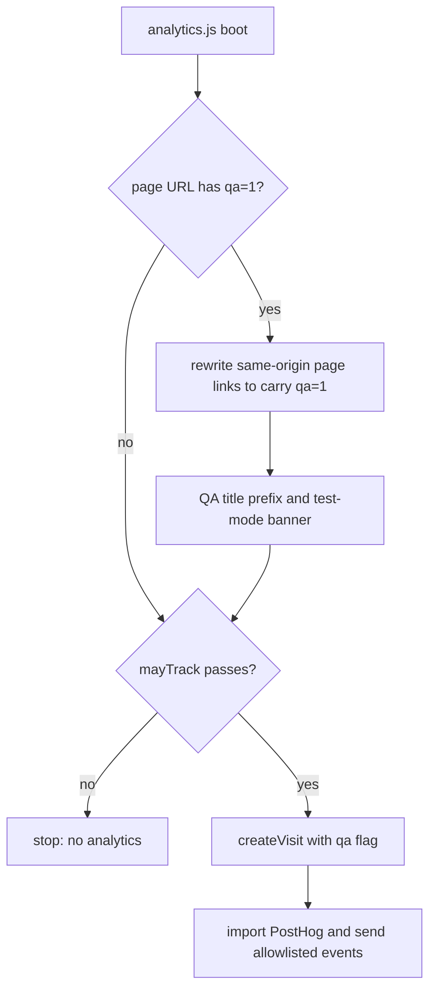
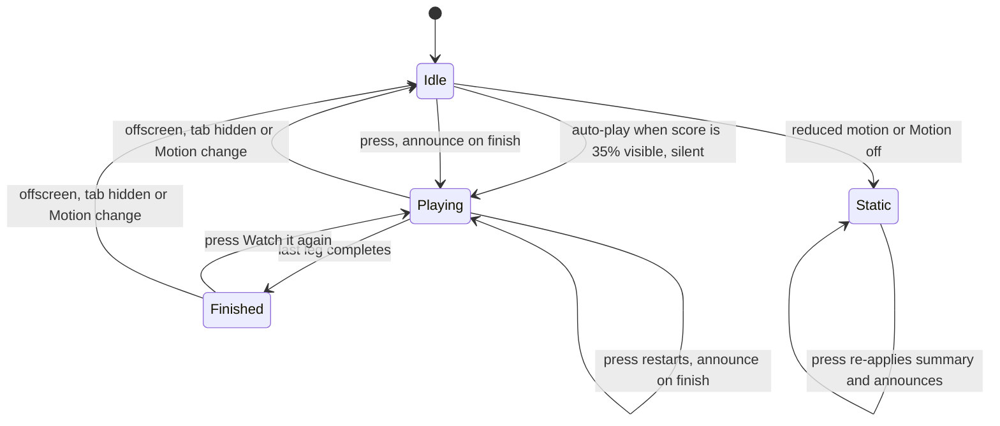

# Pre-promotion fixes for home preview, QA marking and mail focus - Plan

## Goal Capsule

- **Objective:** Before any audience promotion, a link to https://weirdstats.dev unfurls with a branded preview Nate approved, launch measurement counts readers rather than test visits, and keyboard users keep their place when they play the mail journey.
- **Means:** extend the build-time share pipeline to the collection page (KTD1–KTD3), carry the QA marker through in-site links in the URL (KTD4–KTD6), and keep the mail replay control enabled with a press-only announcer (KTD7, KTD8).
- **Authority:** Nate's instructions in chat, then `AGENTS.md`, then this plan, then other repo docs. `docs/editorial/2026-10-05-launch-decision.md` is not edited.
- **Stop conditions:**
  - A change alters an approved entry digest. The build recomputes every pin; never re-pin or re-approve without Nate.
  - The collection card lacks a recorded approval naming its exact strings and PNG hash (R4). Batch B does not merge.
  - A change would need browser storage, a new event property, or a `schema_version` bump (R8).
  - A merge into `main` is needed. Every merge, including docs-only, deploys production and needs Nate's explicit release authorization per batch (KTD9).
- **Execution profile:** two release batches. Batch A is U1–U3; Batch B is U4–U6, after approval.
- **Who finishes:** `ce-work` implements, verifies locally, and opens one PR per batch. Nate approves the card and authorizes each merge. Post-deploy event checks follow the QA procedure from U2.

---

## Product Contract

### Summary

Add an approved, branded social preview to the home page. Make test visits stay marked as tests across in-site navigation, with a visible test-mode cue, and correct the analytics notes about automation. Keep keyboard focus on the mail journey's replay button and announce its result only after a press.

### Problem Frame

The October 5 step 5 check of weirdstats.dev found three problems that matter before promotion.

The home page, the link Nate would post to Hacker News or Reddit, has no Open Graph or Twitter tags. Discovery pages have full previews, but `/` unfurls as a bare title.

Launch measurement cannot separate test traffic from readers. The client allowlist strips the user agent, so PostHog flags every event as automation and that flag cannot filter anything. The `navigator.webdriver` gate misses the in-app browser and extension-driven Chrome. `?qa=1` marks only the landing page, so in-site navigation produces unmarked visits. The check itself sent 72 unmarked visits (12:39:50–12:51:03 CDT, 8 eligible collection visits), and about 10 more of unknown origin arrived between 11:51 and 12:35 CDT. The rolling readout counts them. The launch window has not started.

On the mail discovery, `playJourney()` disables the focused "Watch the round trip" button, which drops keyboard focus to `<body>`. Auto-play can do this with no press at all, after Tab scrolls the score into view. The result's live region sits inside a `role="img"` container, so its updates are probably never announced.

### Requirements

**Home preview**

- R1. Sharing https://weirdstats.dev/ shows a 1200×630 branded preview whose title, description, image text and alt text Nate approved, served in the initial HTML without JavaScript.
- R2. The preview reveals no discovery answer and does not feature any single discovery's question.
- R3. Discovery previews, entry digests and release pins are unchanged, and the home tab title and meta description keep their current text unless Nate's approval changes them.
- R4. The card ships only with a dated approval record that names its exact strings and the SHA-256 of the approved PNG.

**Test-traffic marking**

- R5. A visit that starts on weirdstats.dev with `qa=1` sends `qa: true` on every page reached through the site's own links, including links opened in a new tab.
- R6. Shared and canonical addresses never carry `qa`: share button, clipboard copy, native share, fallback field, canonical, `og:url`, feed, CSV and external links.
- R7. While the QA marker is present, the page shows a visible test-mode cue, so a copied QA address is noticeable before anyone posts it.
- R8. No new data is collected, nothing is stored in the browser, and the event contract stays at `schema_version` 1 with the current allowlist.
- R9. `docs/launch-analytics.md` describes automation handling accurately, maps the launch decision's "recognized automation" to the webdriver gate plus QA marking for Nate to acknowledge, and records today's unmarked test windows.
- R10. A written QA procedure tells people and agents how to run functional checks without tracking and event checks marked as QA, and `AGENTS.md` points agents to it.

**Mail keyboard focus**

- R11. Pressing "Watch the round trip" by keyboard, or tabbing to it while the journey auto-plays, never moves focus off the button, and the button is never disabled.
- R12. After an explicit press, screen reader users hear the journey result once; auto-play, scrolling, visibility changes and Motion changes stay silent.
- R13. The mail entry's approved digest stays unchanged, so the fix needs no editorial re-approval.

### Key Decisions

- **The home preview is a brand card, not a discovery question.** (session-settled: user-approved — chosen over featuring the newest discovery's question: it would go stale and change with every release.) Governs R2.
- **The QA marker travels in the URL, with no browser storage.** (session-settled: user-approved — chosen over a stored "don't track this browser" switch: storage would break the site's stated no-storage privacy promise.) Governs R5, R8. Conflict found in research: a copied QA address now marks every page its recipient visits, so a QA URL pasted into a launch post would erase launch measurement. R7 and the U2 procedure are the mitigation; the risk remains residual.
- **Today's unmarked test visits stay in PostHog, documented by window.** (session-settled: user-approved — chosen over deleting events or editing the readout: they predate launch and fall outside any launch window.) Governs R9.
- **Mail focus stays on the button.** (session-settled: user-approved — chosen over moving focus to the result as copper and crunch do: mail's result is a status line, not a heading.) Governs R11, R12.

### Success Criteria

- After Batch B deploys and before promotion, Facebook's and LinkedIn's preview inspectors show the approved card for https://weirdstats.dev/.
- A recorded QA walk that starts at `https://weirdstats.dev/?qa=1`, uses every in-site link type and logs each page load produces exactly one `qa = true` `visit_started` per logged load in PostHog; any `qa = false` events in its window are recorded as other traffic.
- Keyboard only, at desktop width and 390 px: Tab to the mail button, press Enter twice, Tab onward. Focus never lands on `<body>`.

### Scope Boundaries

- The launch decision's text and threshold stay unchanged; U2 documents how its automation clause is implemented.
- No PostHog events are deleted, and the saved readout `2IZHwHcR` is not edited.
- No browser data such as the user agent is sent to PostHog to make its bot flag work.
- No change to discovery share images, share copy defaults, or any entry content.

#### Deferred to Follow-Up Work

- `public/share.js` disables the share button during sharing, which drops keyboard focus the same way.
- The mail animation runs about 5.2 s, slightly over the five-second settle guidance in the roadmap plan.
- Minor step 5 findings: the mail heading's text reads "9miles", painting stage buttons expose no current stage, the Motion toggle resets per page, the standalone copper page lacks image credits, and the Oxford abstract link was unverifiable from this network.
- The QA marker cannot survive the 404 and withdrawal pages, which load no analytics.

### Open Questions

- Blocking Batch B only: Nate's approval of the card copy and image (R4). U4 produces the review packet.
- Deferred to Batch A review: Nate's acknowledgment that "recognized automation" means the webdriver gate plus QA marking (R9). The doc states the mapping and marks it as awaiting acknowledgment until he confirms.

---

## Planning Contract

### Key Technical Decisions

- KTD1. **Render the card from a separate collection export in `scripts/share-images.mjs`, vector-only.** Reuse the module's bundled Outfit Bold, Resvg options, palette and wordmark; draw original vector artwork and no entry artwork. Entry art would tie the card to release selection and the per-entry ownership guard, and vector output avoids the WebP decode drift seen with the mule card (`docs/hosting.md`). The wordmark stays in Outfit because Georgia is neither bundled nor licensed for the renderer.
- KTD2. **Write the card outside `share/` under a versioned name**, such as `social/home-v1.png`, and bump the version whenever copy or art changes. `tests/routes.test.mjs` asserts the exact contents of `share/`, `share/` is the entry-ID namespace, and crawlers cache images by URL.
- KTD3. **Keep collection copy in its own module and emit the collection head from a collection variant of `metadata()`.** The `shareCopy()` defaults feed four approved digests, so they stay untouched. Move the tab title and meta description out of `src/shell.html` into the build so the head carries exactly one of each, keeping the current title format (R3). Never pass `drafts: true` for the public collection, because a noindex tag disables analytics in `public/analytics.js`.
- KTD4. **Propagate QA in `public/analytics.js` through a pure exported helper, applied once at boot when the page URL has `qa=1`.** It runs before the `mayTrack` gate and the PostHog import, so localhost and preview builds exercise it before merge. Deferred script order already runs it after `share.js` rewrites the permalink. It rewrites only same-origin `a[href]` whose path is `/` or `/discoveries/<id>/`, and leaves hash-only, CSV, external, canonical, `data-share-url` and fallback-input values alone. Rewriting `href` up front covers new-tab and middle-click opens, which click-time rewriting misses.
- KTD10. **`share.js` sets the permalink to the absolute canonical URL only when the page is on that URL's origin.** Elsewhere it keeps the relative `/discoveries/<id>/` href already in the HTML. Today the rewrite happens on every origin, so "Open this discovery" on localhost or a preview opens production, where it is tracked unmarked, and KTD4's same-origin helper skips it. Production behavior and every shared value (R6) stay unchanged.
- KTD5. **The test-mode cue is client-side only.** With `qa=1`, the page prefixes its title with "QA · " and inserts an in-flow strip at the top of the body, reusing the existing `.draft-banner` treatment so it never overlays sticky scenes or the skip link. The strip says the visit is marked as a test and not counted, and how to leave test mode (remove `?qa=1`); the title prefix keeps the cue visible while scrolling. Neither is sent, stored or rendered at build. Exact wording is set at implementation; it is visible only in a QA session.
- KTD6. **Keep `schema_version` at 1 and the allowlist unchanged.** The saved readout filters on `schema_version = 1`; the docs record the date from which `qa` follows navigation.
- KTD7. **Never disable the mail replay button.** Take only the restart-on-press behavior from the runway replay in `public/treatments/runway.js`; unlike runway, which disables its replay under reduced motion, mail's button stays enabled in every state. A press mid-play restarts through the existing `playJourney()` restart path. Under reduced motion or Motion off, a press re-applies the static summary.
- KTD8. **Make a runtime-created, visually hidden status region the only live region for the journey.** `public/app.js` creates it empty at init with `role="status"`, outside the `role="img"` score, and removes `aria-live` from `#journey-status`, which stays where it is as visual text. The region receives the journey summary only on completion of an explicit press; it is cleared first and refilled on the next task so an identical repeated summary is read again. Moving `#journey-status` instead would make auto-play progress audible (about nine updates in five seconds) and break the `.journey-score>p` grid. These runtime changes leave `src/exhibits/mail.html` and its digest untouched (R13).
- KTD9. **Ship two release batches, and carry each batch's post-deploy records in the next authorized release.** Batch A (U1–U3) needs only merge authorization; Batch B (U4–U6) waits for the recorded card approval. Each merge deploys production (`AGENTS.md`), so records that exist only after a deploy never get a release of their own: Batch A's deployment date, redirect check and QA walk go into Batch B's PR, and Batch B's deployment and unfurl checks go into the next authorized release.

### High-Level Technical Design

Analytics boot with QA marking. `share.js` has already rewritten permalinks because deferred classic scripts run before the module.

Mail journey states. The button is enabled in every state; only a press arms the announcer.

### Risks & Dependencies

| Risk | Mitigation |
| --- | --- |
| A copied QA address marks real readers | R7 cue, U2 procedure rule against posting QA URLs; residual |
| The domain redirects drop `?qa=1` (www to apex, `weird-stats.vercel.app` to apex, trailing slash) | Check with `curl -sI` after Batch A deploys; it runs no JavaScript and sends no events |
| An Outfit glyph is missing and renders blank in the card | Inspect the rendered PNG in U4 before approval |
| The first published card persists in crawler caches | Approval precedes Batch B; versioned filename (KTD2) |
| An accidental fragment edit changes a digest | The build recomputes pins and fails; stop condition |
| Docs-only merges redeploy production | Merge only per batch with authorization (KTD9) |

### System-Wide Impact

- **Measurement validity:** U1 and U2 decide what the launch readout counts; they change no event schema.
- **Privacy promise:** unchanged. The marker never leaves the browser as a URL, because `filterEvent` drops URL fields.
- **Agent workflows:** the U2 procedure binds every future automated check, including Claude sessions, through `AGENTS.md`.
- **Third-party caches:** Batch B publishes the first home preview to crawlers.

---

## Implementation Units

### U1. QA link propagation and test-mode cue

- **Goal:** keep a QA session marked as it navigates, and make QA mode visible.
- **Requirements:** R5, R6, R7, R8, R10; KTD4, KTD5, KTD6, KTD10.
- **Dependencies:** none.
- **Files:** `public/analytics.js`, `public/share.js`, `public/styles.css`, `tests/analytics.test.mjs`, `tests/routes.test.mjs`.
- **Approach:**
  1. Add a pure exported helper that returns the QA-marked `href` for an eligible same-origin page link, or the original value otherwise.
  2. In `boot()`, when the page's own URL has `qa=1`, apply it to every `a[href]` and add the title prefix and strip, before the `mayTrack` return.
  3. In `share.js`, set the permalink to the canonical URL only when the page is on its origin (KTD10).
  4. Leave `createVisit`, `filterEvent`, `posthogOptions` and `schema_version` unchanged.
- **Patterns to follow:** existing pure exports `mayTrack`, `filterEvent` and `createVisit` and their unit tests; the `share.js` vm harness in `tests/routes.test.mjs`.
- **Test scenarios:**
  - `/discoveries/mail/` and `https://weirdstats.dev/` both gain `qa=1`.
  - An absolute same-origin permalink, as `share.js` writes it, gains `qa=1`.
  - `#copper`, `#top`, `/data/same-two-seats.csv`, an `https://` source link, and a different origin are left unchanged.
  - A path outside `/` and `/discoveries/<id>/`, such as `/review.html`, is left unchanged.
  - A link that already carries `qa=1` is not duplicated; one with other query parameters keeps them.
  - With `qa` absent, `qa=0` or `qa=true`, nothing is rewritten and no cue appears.
  - With `qa=1`, the share control's native share, clipboard text and fallback field still receive the clean canonical URL while the permalink anchor carries `qa=1`.
  - On a page whose origin is not the canonical origin, such as `http://localhost:63014/`, the permalink keeps its relative `/discoveries/<id>/` href; on the canonical origin it becomes the absolute canonical URL. Shared values are canonical on both.
  - A visit created from a `qa=1` page sends `qa: true` on `visit_started`.
- **Verification:** unit tests pass; in a local build, opening `/?qa=1` shows the cue, every cross-page link in the collection and each discovery page carries `qa=1` and stays on the local origin, and the share copy stays clean. The strip is legible and covers no control at 390 px in light and dark appearance.

### U2. Analytics notes correction and QA procedure

- **Goal:** make the docs match how automation and QA actually work, and give people and agents one procedure.
- **Requirements:** R9, R10; KTD6.
- **Dependencies:** U1, so the procedure describes shipped behavior.
- **Files:** `docs/launch-analytics.md`, `AGENTS.md`, `docs/hosting.md`.
- **Approach:**
  1. In `docs/launch-analytics.md`, replace the automation statements: PostHog's automation flag is set on every event because the allowlist strips `$raw_user_agent`, and the webdriver gate misses the in-app browser, extension-driven Chrome and some Playwright setups.
  2. Add the mapping of "recognized automation" to the webdriver gate plus QA marking, marked as awaiting Nate's acknowledgment.
  3. Record the unmarked windows from October 5 (11:51–12:35 CDT, unknown origin; 12:39:50–12:51:03 CDT, Claude step 5 check), noting they precede any launch window.
  4. Add a QA procedure section: functional checks run on localhost, preview or immutable deployment URLs, which never track; event checks start at `https://weirdstats.dev/?qa=1`, stay on in-site links, record start and end times, and never copy a QA address into a share or post.
  5. Add one `AGENTS.md` line pointing agents to that procedure.
- **Test expectation:** none -- documentation only.
- **Verification:** each statement in the corrected sections matches `public/analytics.js` and the PostHog observations from October 5.

### U3. Mail replay keeps focus and announces after a press

- **Goal:** keyboard users keep their place, and screen reader users hear the result once after pressing.
- **Requirements:** R11, R12, R13; KTD7, KTD8.
- **Dependencies:** none.
- **Files:** `public/app.js`, `public/styles.css`, `tests/runtime-facts.test.mjs`.
- **Approach:**
  1. Remove every `replay.disabled` assignment in the mail journey code.
  2. At init, remove `aria-live` from `#journey-status` and create the empty status region after the score (KTD8), reusing an existing hidden-text style in `public/styles.css` if one fits.
  3. Track whether the current run began from a press; announce the summary only when such a run finishes or the static summary is applied by a press.
  4. Leave `src/exhibits/mail.html` untouched.
- **Patterns to follow:** the restart-on-press behavior of the `public/treatments/runway.js` replay, without its reduced-motion disabling (KTD7); the `vm` harness for `#replay-journey` in `tests/runtime-facts.test.mjs`.
- **Test scenarios:**
  - After init, `#journey-status` has no `aria-live`, and the new region exists with `role="status"`, is empty, and is not inside `[role="img"]`.
  - A press starts the run, and `replay.disabled` is never true during or after it.
  - An observer-triggered auto-play never disables the button and never writes to the status region, while `#journey-status` still shows progress text.
  - A press mid-play cancels earlier timers, restarts, and announces once at the end.
  - Two presses in a row each clear and refill the region, so the same summary is written twice.
  - Visibility hidden and `motionchange` reset the run without writing to the status region.
  - With reduced motion, a press applies the static summary and announces it once, and the page load stays silent.
  - The leg labels and durations still come from the fragment, as the existing runtime-facts test requires.
- **Verification:** tests pass; the build's pinned digest check passes with mail unchanged; in a browser at desktop and 390 px, Tab to the button and press Enter twice with no focus loss, including with Motion off and with reduced motion emulated. A VoiceOver pass in Safari, pressing twice with Motion on and twice with reduced motion, speaks the summary after each press and nothing during auto-play.

### U4. Collection preview copy, renderer and review packet

- **Goal:** produce the card and its copy for Nate to approve.
- **Requirements:** R1, R2, R4; KTD1, KTD2, KTD3.
- **Dependencies:** none; can start in parallel with Batch A.
- **Files:** `scripts/share-images.mjs`, `scripts/collection-copy.mjs`, `tests/share-art.test.mjs`.
- **Approach:**
  1. Add the collection copy module: preview title, description, image text and alt, plus the card version used in its filename.
  2. Add a collection render export beside `renderShareImage`, laid out from the existing card anatomy with vector-only art.
  3. Render a review PNG to an ignored path, such as `artifacts/`, and present it to Nate with the exact strings and its SHA-256.
- **Patterns to follow:** `shareSVG` card anatomy and `shareLayout`; `tests/share-art.test.mjs` font and no-`<image` assertions.
- **Test scenarios:**
  - The SVG uses only Outfit at weight 700, with no `stroke=` text outlines and no `<image` elements.
  - The card contains no entry question or answer text from the fixture entries.
  - The rendered PNG is 1200×630.
  - Rendering twice yields identical bytes.
  - Copy that would overflow the layout fails clearly rather than clipping.
- **Verification:** tests pass; Nate has viewed the review PNG and strings. His approval is recorded in U6.

### U5. Collection head metadata and card output

- **Goal:** serve the approved card and tags from `/`.
- **Requirements:** R1, R3; KTD2, KTD3.
- **Dependencies:** U4, plus Nate's approval.
- **Files:** `scripts/build.mjs`, `src/shell.html`, `tests/routes.test.mjs`, `tests/content.test.mjs`.
- **Approach:**
  1. Move the tab title and meta description from `src/shell.html` into the build's collection metadata, keeping their current text.
  2. Emit the collection variant of the Open Graph and Twitter tags pointing to `${publicOrigin}/social/home-v<N>.png`.
  3. Render the PNG in the build's pre-`rm` validation phase and write it to its own directory.
- **Patterns to follow:** `metadata()` and the discovery page path in `scripts/build.mjs`; the head assertions in `tests/routes.test.mjs`.
- **Test scenarios:**
  - The public collection head has exactly one `<title>`, one description and one canonical, with `og:title`, `og:description`, `og:url`, `og:image` with type, size and alt, and `twitter:card` set to `summary_large_image`.
  - `og:image` uses the configured public origin and the versioned path, and the file exists at 1200×630.
  - The public collection has no robots tag; the drafts build has `noindex`.
  - The collection head contains no draft ID, question or answer.
  - `share/` contents are unchanged in the existing route tests, including the withdrawals-only build.
  - Discovery page heads and PNG bytes are unchanged.
- **Verification:** `npm run build` succeeds with all pins intact; the built `index.html` head matches the approved strings.

### U6. Approval record and documentation

- **Goal:** record the approval and document the new build asset.
- **Requirements:** R4.
- **Dependencies:** U5.
- **Files:** `docs/editorial/2026-10-DD-home-preview-approval.md`, `docs/editorial/asset-provenance-check.md`, `docs/content-system.md`, `docs/hosting.md`.
- **Approach:**
  1. Write the approval note quoting Nate's message, with `by`, a timezone-bearing `at`, the exact strings, the PNG SHA-256 and the card version, following `docs/editorial/2026-10-05-launch-decision.md`.
  2. Add a provenance line for the original vector art.
  3. Describe the collection preview in the sharing section of `docs/content-system.md`.
  4. Record Batch A's deployment date, redirect check and QA walk results in `docs/hosting.md` and `docs/launch-analytics.md` (KTD9).
- **Test expectation:** none -- documentation only.
- **Verification:** the note's hash matches the PNG the build emits.

---

## Verification Contract

| Gate | Applies to | Proves |
| --- | --- | --- |
| `npm run check` | every unit | content, assets, anchors and pinned digests |
| `npm test` | U1, U3, U4, U5 | the scenarios above, plus the existing 85 tests |
| `npm run build` | every batch | public output builds with all release pins |
| Local browser, served from a local build | U1, U3 | QA cue and links; mail focus at desktop and 390 px, Motion off, reduced motion |
| VoiceOver in Safari on a local build | U3 | R12: one spoken summary per press, silence during auto-play |
| `curl -sI` on www, `weird-stats.vercel.app` and slashless URLs with `?qa=1` | after Batch A deploys | redirects keep the marker |
| QA walk from `https://weirdstats.dev/?qa=1` with each page load logged, excluding back-forward restores, then a PostHog query for its window | after Batch A deploys | one `qa = true` `visit_started` per logged load, by page kind |
| Anonymous fetch of `/` and the card, then Facebook and LinkedIn preview inspectors run by Nate | after Batch B deploys | R1 in the real unfurl |

Local and preview origins never initialize analytics, so local checks send no events. Production checks follow the U2 procedure.

---

## Definition of Done

- **Batch A:** U1–U3 merged with Nate's authorization; the redirect and QA-walk gates pass; `docs/launch-analytics.md` either records Nate's acknowledgment of the automation mapping or says it is awaited.
- **Batch B:** the approval note exists before merge; U4–U6 merged with authorization, carrying Batch A's post-deploy records; the production unfurl shows the approved card. Batch B's own deployment and unfurl records wait for the next authorized release (KTD9).
- **Both batches:** no entry digest, share copy default or release pin changed; no `dist/` or `review-dist/` output committed; no abandoned experimental code left in the diff.
